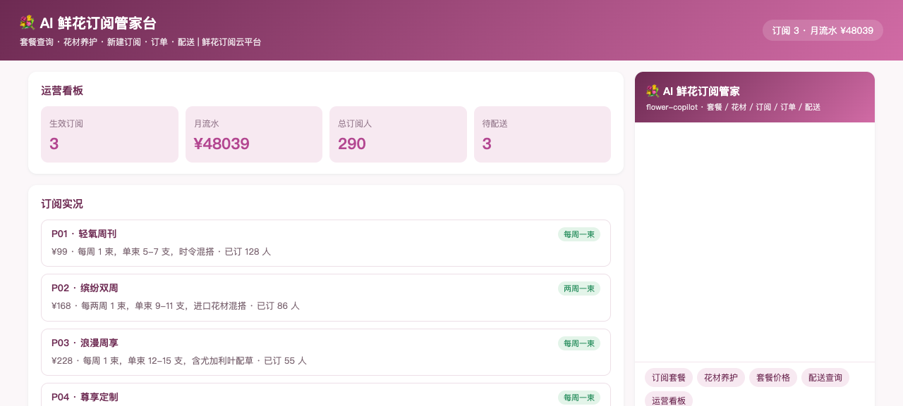
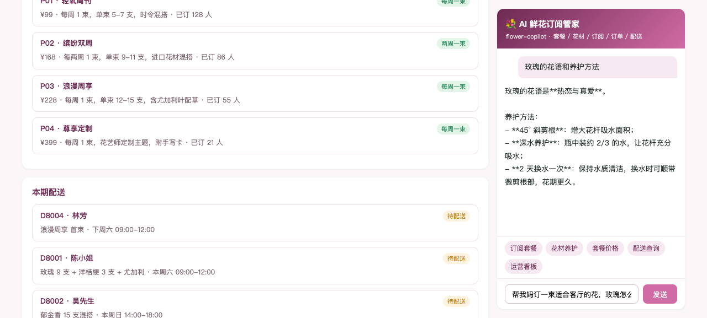
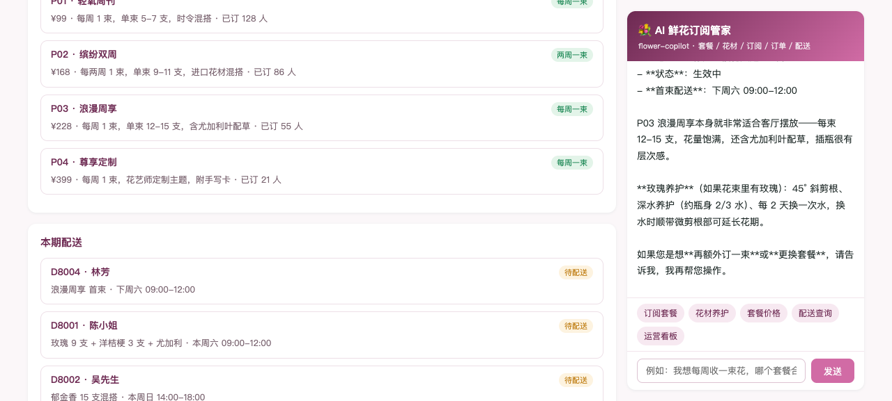
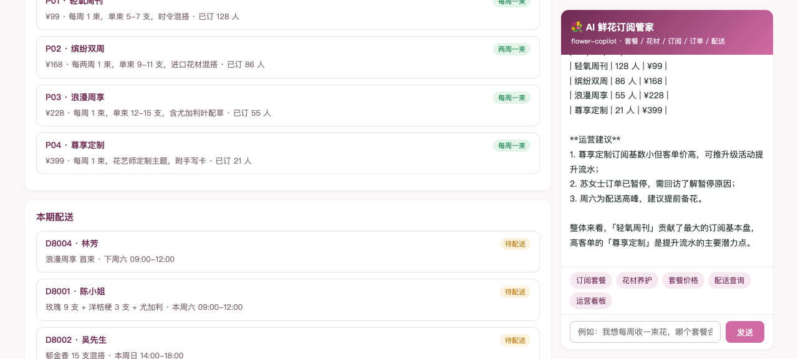

# 💐 Flower Subscription · AI 鲜花订阅管家（DSH Java Native Plugin 场景案例 P66）

> 基于 [deepseek-harness-java（DSH）](https://github.com/deepseek-harness-java) Java Native Plugin 机制构建的鲜花订阅智能管家：套餐查询、花材花语与养护、新建订阅、订阅跟踪、配送查询、运营统计，一个 Agent 全搞定。

  

## ✨ 功能总览

| 工具 | 说明 | 对应 REST |
|------|------|-----------|
| `plan_list` | 订阅套餐（4 档：¥99–¥399，频次/花量/订阅人数） | `GET /api/plans` |
| `flower_care` | 花材花语与养护（玫瑰/向日葵/郁金香/洋桔梗/尤加利叶） | `GET /api/flowers?name=` |
| `subscribe` | 新建订阅（要素确认，报订阅编号与首束时间） | `POST /api/subscribe` |
| `sub_info` | 订阅查询（套餐/地址/下次配送/历史配送） | `GET /api/sub?subId=` |
| `deliveries` | 配送列表（花束/收花人/时段/状态） | `GET /api/deliveries` |
| `stats` | 运营看板（生效订阅/MRR/分套餐分布/建议） | `GET /api/stats` |

## 🖼 界面预览

### 运营看板


### 花材养护咨询


### 新建订阅


### 运营统计


## 🏗 架构

```
用户 ⇄ p-app (Spring Boot :18105, SSE 代理)
           │  POST /api/assistant/stream → DSH /api/agent/stream (agentId=flower-copilot)
           ▼
   DSH Harness (:8090, standalone, H2)
           │  plugin__flower-copilot__<tool>
           ▼
   p-plugin (FlowerPlugin, JAVA_NATIVE in-process)
           │  HTTP
           ▼
   p-app REST API（6 个业务端点）
```

- **p-app**：鲜花订阅业务系统（内存数据：4 档套餐、3 个订阅、4 单配送、5 种在售花材），并内置 AI 对话页（SSE 流式，粉紫主题）。
- **p-plugin**：`AbstractHarnessPlugin` 实现，注册 6 个 `AbstractTool` + 系统提示词（订阅前复述要素、花语养护只转述）+ `PRE_TOOL_USE` 钩子。

## 🚀 快速开始

### 1. 启动 DSH（standalone 模式，本地 H2 无需外部 MySQL）

```bash
java -Dspring.profiles.active=standalone -Dserver.port=8090 -jar deepseek-harness-java-app.jar
```

在 DSH 控制台配置模型（baseUrl + apiKey）。

### 2. 构建并安装插件

```bash
mvn clean package -DskipTests
# 通过 DSH 控制台或 /api/harness/plugins/install 上传 p-plugin/target/p-plugin-1.0.0-SNAPSHOT.jar
# 激活：POST /api/harness/plugins/activate {"pluginId":"flower-copilot"}
```

### 3. 启动业务应用

```bash
java -Dserver.port=18105 -jar p-app/target/p-app-1.0.0-SNAPSHOT.jar
```

打开 <http://127.0.0.1:18105> 即可使用。

### 4. 命令行验证（SSE 流式）

```bash
curl -N -X POST http://127.0.0.1:8090/api/agent/stream \
  -H 'Content-Type: application/json' \
  -d '{"agentId":"flower-copilot","message":"有哪些订阅套餐？"}'
```

## 📁 项目结构

```
flower-subscription/
├── p-app/       # 鲜花订阅业务 + AI 前台（Spring Boot, :18105）
│   └── src/main/java/cn/xiaofuge/g/app/
│       ├── FlowerApplication.java     # 启动类
│       ├── GController.java           # 6 个 REST 端点
│       ├── GStore.java                # 业务数据与规则（套餐/订阅/配送/统计）
│       └── AssistantController.java   # SSE 代理到 DSH
├── p-plugin/    # DSH Java Native 插件
│   └── src/main/java/cn/xiaofuge/g/plugin/
│       └── FlowerPlugin.java          # 6 工具 + 系统提示词 + 钩子
└── docs/images/ # 截图
```

## 📖 更多

详细使用说明见 [docs/使用说明.md](docs/使用说明.md)。

## License

MIT
